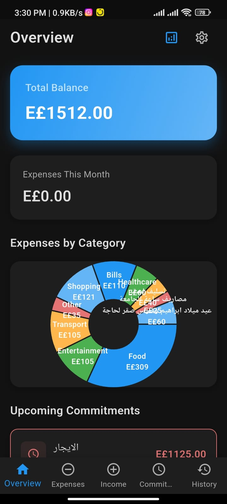
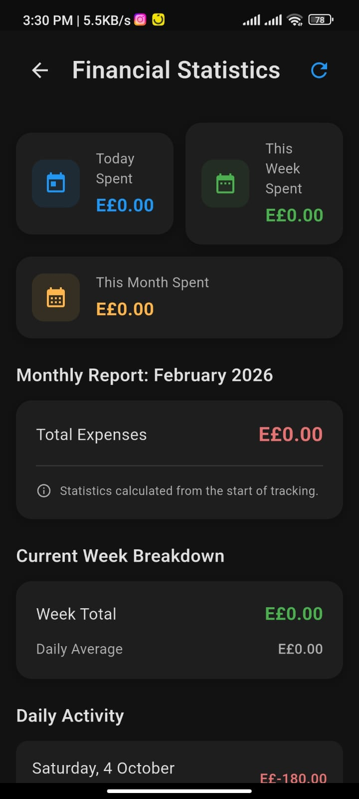
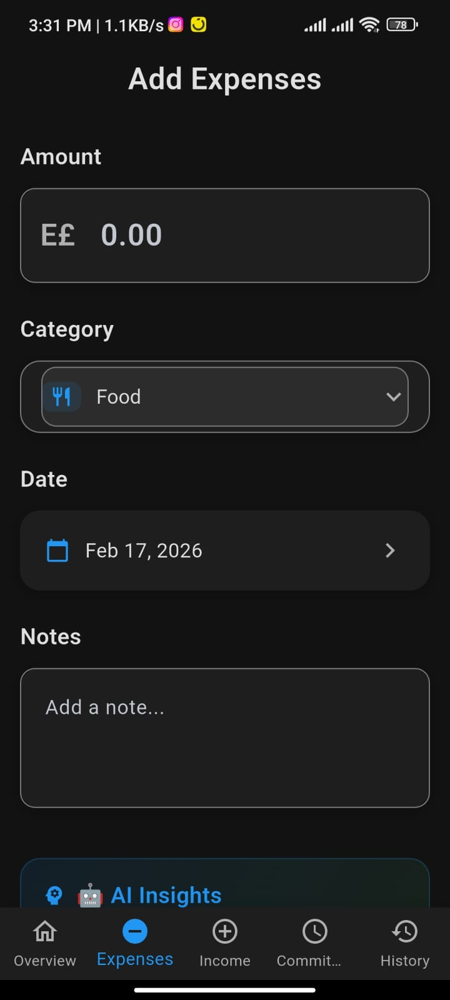

# 💰 Money Follow - Smart Financial Tracker

A modern Flutter expense tracking app with **AI-powered insights** and **intelligent categorization**.


## ✨ Features

### 🤖 **AI-Powered Smart Features**
- **Automatic Category Detection** - AI suggests categories based on expense descriptions
- **Personalized Financial Tips** - Get smart recommendations based on your spending patterns
- **Budget Insights** - AI analyzes your spending and provides actionable advice
- **Custom Categories** - Create personalized expense categories

### 🎨 **Modern UI/UX**
- **Dark/Light Mode** - Beautiful themes with proper contrast
- **Multi-Language Support** - English, Arabic, French, German, Japanese
- **Material Design 3** - Modern, clean interface
- **Responsive Design** - Works perfectly on all screen sizes

### 🏗️ **Robust Architecture**
- **BLoC Pattern** - Clean separation of business logic and UI
- **SQLite Database** - Reliable local data storage
- **Comprehensive Validation** - Smart form validation with helpful messages
- **Error Handling** - Graceful error handling throughout the app

### 📊 **Financial Management**
- **Expense Tracking** - Track all your expenses with categories
- **Income Management** - Record and manage income sources
- **Commitments** - Track recurring bills and commitments
- **History & Analytics** - View spending history with insights
- **Backup & Restore** - Secure data backup and restore functionality

## 🚀 Quick Start

### Prerequisites
- Flutter SDK (3.8.1 or higher)
- Dart SDK
- Android Studio / VS Code

### Installation
```bash
# Clone the repository
git clone <your-repo-url>
cd money_follow

# Get dependencies
flutter pub get

# Run the app
flutter run
```

### Building for Release
```bash
# Android APK
flutter build apk --release

# iOS (requires macOS and Xcode)
flutter build ios --release
```

## 🤖 AI Features Demo

### Smart Category Detection
```
Type "Coffee at Starbucks" → AI suggests "Food" category
Type "Uber ride to airport" → AI suggests "Transport" category  
Type "Netflix subscription" → AI suggests "Bills" category
```

### Personalized Tips
```
"Food expenses are 25% of income - consider meal planning"
"Great job! You're saving 20% of your income"
"Transport costs are high. Consider carpooling or public transport"
```

## 📱 Screenshots

<p>
  
  
  
</p>

<p>
  
  
  
</p>

<p>
  
  
  
</p>

<p>
  
  
  
</p>

## 🏗️ Architecture

### BLoC Pattern Implementation
```
lib/
├── bloc/                 # Business Logic Components
│   ├── expense/         # Expense-related BLoC
│   ├── income/          # Income-related BLoC
│   └── commitment/      # Commitment-related BLoC
├── model/               # Data Models
├── services/            # Services (AI, Database, etc.)
├── view/                # UI Components
└── utils/               # Utilities and Helpers
```

### Key Components
- **Events** - Define what can happen (AddExpense, UpdateExpense, etc.)
- **States** - Define app states (Loading, Loaded, Error, etc.)
- **BLoCs** - Handle business logic and state transitions
- **UI** - Clean presentation layer with no business logic

## 🧪 Testing

```bash
# Run all tests
flutter test

# Run specific test file
flutter test test/ai_suggestion_test.dart

# Generate coverage report
flutter test --coverage
```

## 📚 Documentation

- [**IMPROVEMENTS_SUMMARY.md**](IMPROVEMENTS_SUMMARY.md) - Detailed list of all improvements
- [**DEMO_GUIDE.md**](DEMO_GUIDE.md) - Step-by-step guide to test new features
- [**API Documentation**](docs/api.md) - Code documentation

## 🤝 Contributing

1. Fork the repository
2. Create a feature branch (`git checkout -b feature/amazing-feature`)
3. Commit your changes (`git commit -m 'Add amazing feature'`)
4. Push to the branch (`git push origin feature/amazing-feature`)
5. Open a Pull Request

## 📄 License

This project is licensed under the MIT License - see the [LICENSE](LICENSE) file for details.

## 🙏 Acknowledgments

- Flutter team for the amazing framework
- Material Design team for the design system
- Contributors and testers

## 📞 Support

If you have any questions or need help:
- Create an issue on GitHub
- Check the [FAQ](docs/faq.md)
- Review the [troubleshooting guide](docs/troubleshooting.md)

---

**Made with ❤️**
